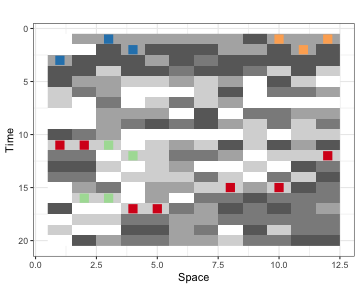
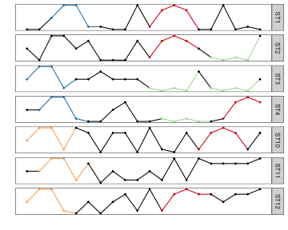

<!-- README.md is generated from README.Rmd. Please edit that file -->

# STMotif: Discovery of Motifs in Spatial-Time Series 

[](https://www.r-pkg.org/pkg/STMotif)
[](https://www.r-pkg.org/pkg/STMotif)


**STMotif** is an R package that allows identifying motifs in space-time series. A motif is a previously unknown subsequence to a (spatial) time series with a relevant number of occurrences. The package implements the approach Combined Series Approach (CSA).


For a full overview of all options it is best to read the
[**vignette**](https://cran.r-project.org/web/packages/STMotif/vignettes/STMotif.html).

## Installation

  - Install from CRAN:

<!-- end list -->

``` r
install.packages("STMotif")
```

  - Install latest development version from GitHub (requires
    [remotes](https://github.com/r-lib/remotes) package):

<!-- end list -->

``` r
remotes::install_github("heraldoborges/STMotif", ref = "develop", dependencies = TRUE)
```

## Examples

Examples using the synthetic data provided in the package.


``` r

# The process is launched on the provided example dataset
dim(D <- STMotif::example_dataset)
#> [1] 20 12

# Normalizartion and SAX indexing
DS <- NormSAX(D = STMotif::example_dataset,a =5)

# Information of the normalized and SAX indexing dataset 
# The candidates built 
head(NormSAX(D = STMotif::example_dataset, a = 5)[,1:10])
#>                      
#> 1 a c c c c c c c e c
#> 2 a a e c e e e c c e
#> 3 c e e e c e d e e e
#> 4 e e b e e d e e d b
#> 5 e c c b b c b c a e
#> 6 b d c a a a b e a d

```

``` r

# The list of motifs 
# stmotifs <- SearchSTMotifs(D,DS,w,a,sb,tb,si,ka)
stmotifs <- SearchSTMotifs(D,DS,4,5,4,10,2,2)
stmotifs[[1]]
#> $isaxcod
#> [1] "ceeb"
#> 
#> $recmatrix
#>      [,1] [,2] [,3]
#> [1,]    1    0    0
#> [2,]    0    0    0
#> 
#> $vecst
#>   s t
#> 1 1 3
#> 2 3 1
#> 3 4 2

```

``` r

# The rank list of stmotifs 
rstmotifs <- RankSTMotifs(stmotifs)
rstmotifs[[1]]
#> $isaxcod
#> [1] "bded"
#> 
#> $recmatrix
#>      [,1] [,2] [,3]
#> [1,]    0    0    0
#> [2,]    1    1    1
#> 
#> $vecst
#>    s  t
#> 1  1 11
#> 2  2 11
#> 3  4 17
#> 4  5 17
#> 5  8 15
#> 6 10 15
#> 7 12 12
#> 
#> $rank
#> $rank$dist
#> [1] 0.5259316
#> 
#> $rank$word
#> [1] 1.5
#> 
#> $rank$qtd
#> [1] 2.807355
#> 
#> $rank$proj
#>       [,1]
#> 3 1.522208

```

``` r

# CSAMiningProcess
rstmotifs <- RankSTMotifs(stmotifs)
rstmotifs[[1]]
#> $isaxcod
#> [1] "bded"
#> 
#> $recmatrix
#>      [,1] [,2] [,3]
#> [1,]    0    0    0
#> [2,]    1    1    1
#> 
#> $vecst
#>    s  t
#> 1  1 11
#> 2  2 11
#> 3  4 17
#> 4  5 17
#> 5  8 15
#> 6 10 15
#> 7 12 12
#> 
#> $rank
#> $rank$dist
#> [1] 0.5259316
#> 
#> $rank$word
#> [1] 1.5
#> 
#> $rank$qtd
#> [1] 2.807355
#> 
#> $rank$proj
#>       [,1]
#> 3 1.522208


```


``` r
## Plot a heatmap of the dataset and highlight the selected motifs from the list
display_motifsDataset(dataset = STMotif::example_dataset, rstmotifs[c(1:4)],  5)
```


``` r
## Plot the selected spatial-time series with the selected motifs highlighted
display_motifsSTSeries(dataset = STMotif::example_dataset,rstmotifs[c(1:4)],space = c(1:4,10:12))
```



