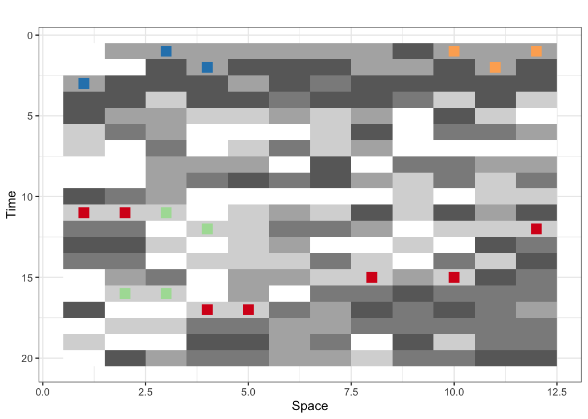
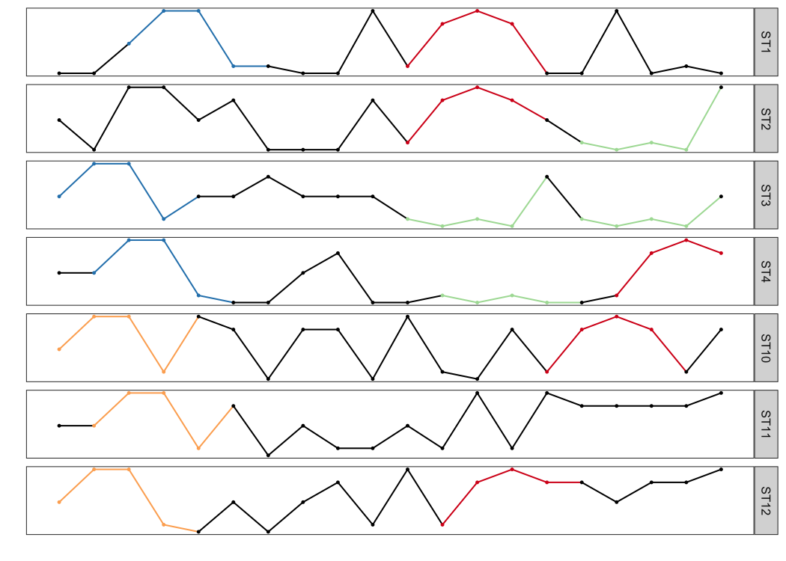

<!-- README.md is generated from README.Rmd. Please edit that file -->

# STMotif 

<!-- badges: start -->

[](https://CRAN.R-project.org/package=STMotif)
[](https://github.com/heraldoborges/STMotif/actions/workflows/R-CMD-check.yaml)
[](https://CRAN.R-project.org/package=STMotif)
[](https://lifecycle.r-lib.org/articles/stages.html#stable)
[](https://www.gnu.org/licenses/gpl-3.0)
<!-- badges: end -->

**STMotif** discovers and ranks motifs in spatial-time series using the
Combined Series Approach (CSA). A *motif* is a previously unknown
subsequence of a spatial time series with a relevant number of
occurrences. The package uses SAX (Symbolic Aggregate approXimation)
encoding for efficient pattern matching across space and time
dimensions.

## Installation

Install the stable version from CRAN:

``` r
install.packages("STMotif")
```

Or install the development version from GitHub:

``` r
# install.packages("pak")
pak::pak("heraldoborges/STMotif")
```

## Quick start

``` r
library(STMotif)

# Load the example dataset (20 time points × 12 spatial series)
D <- STMotif::example_dataset
dim(D)
#> [1] 20 12
```

### Full workflow in one call

``` r
# 1. Normalize + SAX encode
DS <- NormSAX(D, a = 5)

# 2. Discover and rank motifs (all-in-one)
rstmotifs <- CSAMiningProcess(D, DS, w = 4, a = 5, sb = 4, tb = 10, si = 2, ka = 2)

# Top-ranked motif
cat("Top motif:", rstmotifs[[1]]$isaxcod, "\n")
#> Top motif: bded
cat("Occurrences:", nrow(rstmotifs[[1]]$vecst), "\n")
#> Occurrences: 7
cat("Projection score:", round(rstmotifs[[1]]$rank$proj, 4), "\n")
#> Projection score: 1.5222
```

### Visualization

``` r
# Heatmap with highlighted motif positions
display_motifsDataset(
  dataset  = D,
  rstmotifs = rstmotifs[1:4],
  alpha    = 5
)
#> Warning: Removed 223 rows containing missing values or values outside the scale range
#> (`geom_point()`).
```



``` r
# Time series with highlighted motif segments
display_motifsSTSeries(
  dataset   = D,
  rstmotifs = rstmotifs[1:4],
  space     = c(1:4, 10:12)
)
```



### Step-by-step workflow

For more control, you can run each step individually:

``` r
# Step 1: Normalize and SAX-encode the dataset
DS <- NormSAX(D, a = 5)
head(DS[, 1:6])
#>              
#> 1 a c c c c c
#> 2 a a e c e e
#> 3 c e e e c e
#> 4 e e b e e d
#> 5 e c c b b c
#> 6 b d c a a a

# Step 2: Search for motifs in spatio-temporal blocks
stmotifs <- SearchSTMotifs(D, DS, w = 4, a = 5, sb = 4, tb = 10, si = 2, ka = 2)
cat(length(stmotifs), "motifs found\n")
#> 4 motifs found

# Step 3: Rank motifs by quality
rstmotifs <- RankSTMotifs(stmotifs)
cat("Top motif:", rstmotifs[[1]]$isaxcod, "\n")
#> Top motif: bded
```

## Parameters

| Parameter | Description                      | Typical values |
|-----------|----------------------------------|----------------|
| `a`       | SAX alphabet size                | 3–7            |
| `w`       | Motif length (SAX symbols)       | 3–6            |
| `sb`      | Spatial block size (columns)     | 3–6            |
| `tb`      | Temporal block size (rows)       | 5–20           |
| `si`      | Min occurrences per block (σ)    | 2–5            |
| `ka`      | Min spatial series per block (κ) | 2–4            |

## Documentation

- [Package
  vignette](https://CRAN.R-project.org/package=STMotif/vignettes/STMotif.html)
  — full walkthrough with explanations
- [Reference
  manual](https://CRAN.R-project.org/package=STMotif/STMotif.pdf) — all
  function documentation

## Citation

If you use STMotif in your research, please cite:

    Warning in citation("STMotif"): could not determine year for 'STMotif' from
    package DESCRIPTION file
    To cite package 'STMotif' in publications use:

      Borges H, Bazaz A, Pacciti E, Ogasawara E (????). _STMotif: Discovery
      of Motifs in Spatial-Time Series_. R package version 2.0.3,
      <https://github.com/heraldoborges/STMotif>.

    A BibTeX entry for LaTeX users is

      @Manual{,
        title = {STMotif: Discovery of Motifs in Spatial-Time Series},
        author = {Heraldo Borges and Amin Bazaz and Esther Pacciti and Eduardo Ogasawara},
        note = {R package version 2.0.3},
        url = {https://github.com/heraldoborges/STMotif},
      }

## Contributing

Contributions are welcome! Please open an
[issue](https://github.com/heraldoborges/STMotif/issues) for bug reports
or feature requests, or submit a pull request.

## License

GPL-3 © Heraldo Borges, Amin Bazaz, Eduardo Ogasawara
